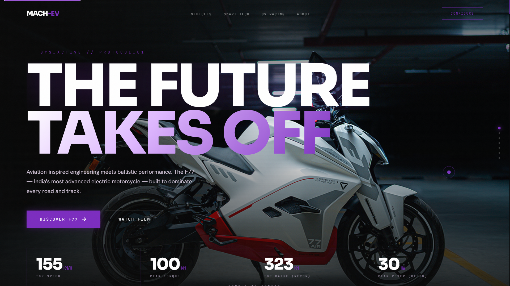

# Ultraviolette F77 Mach 2 Clone

A high-performance, cinematic, vanilla web recreation of the official **[Ultraviolette F77 Mach 2](https://www.ultraviolette.com)** website. Built strictly with standard HTML5, CSS3, and JavaScript, focusing on lightweight rendering, zero external library dependencies, and interactive WebGL/Web Audio systems.

---

## ◼ Preview



<div align="center">

`🔗` **[ultraviolette-website-clone.vercel.app](https://ultraviolette-website-clone.vercel.app)**

</div>

---

## About the Project

This clone is a **pixel-close recreation** of the Ultraviolette Automotive landing page—one of the most visually refined EV brand sites on the web. 

The goal was to rebuild the site from first principles without heavy libraries or frameworks, studying layout mechanics, animation states, and performant scroll triggers.

> [!WARNING]
> This repository is built strictly for **educational and portfolio purposes**. All trademarks, images, and logos belong to **Ultraviolette Automotive Pvt. Ltd., Bangalore**.

---

## Performance & Optimization Highlights

To ensure smooth animations and low CPU/GPU footprints, the following optimization techniques are implemented:
* **Zero Scroll-Jacking:** Leverages hardware-accelerated native browser scrolling, keeping gesture momentum and kinetic responsiveness fully intact.
* **Layout Dimension Caching:** Layout dimensions, offset measurements, and scroll heights are queried once on page load and cached on window resize events, completely eliminating forced reflows (layout thrashing) on scroll ticks.
* **WebGL Activity Sleep:** Canvas viewport sizes are queried only during resize observer callbacks (not on every animation frame), and GL rendering pauses automatically when the tab is inactive or minimized.
* **Magnetic Hover Bounding Rect Caching:** Bounding dimensions of interactive elements are cached on hover entry to prevent coordinate shifting loops during hover translations.

---

## Core Features

* **TFT Instrument Mockup:** An interactive digital dashboard cluster updating clock speeds, temperature levels, and alert parameters dynamically when toggling Glide, Combat, Ballistic, and Ballistic+ riding modes.
* **Programmatic Web Audio Synth:** A raw Web Audio API synthesizer that generates a mechanical electric powertrain drone, pitch-modulating dynamically based on the user's scroll velocity.
* **Hotspot Chassis Explorer:** An interactive blueprints page mapping vehicle parts with dynamic, responsive SVG indicator line sweeps.
* **Trim Configuration Estimator:** Real-time calculation widgets estimating battery range and fast charging times relative to base and Recon trim parameters.
* **PWA & Offline Support:** Integrated service worker (`sw.js`) cache registers to facilitate instantaneous subsequent loads and partial offline operation.

---

## Tech Stack

| Technology | Role | Implementation Details |
| :--- | :--- | :--- |
| **HTML5** | Semantic Layout | Semantic structures, JSON-LD structured product tags, and responsive image configurations |
| **CSS3** | Premium Aesthetics | Custom animations, responsive grids, dark theme gradients, and custom glassmorphism styles |
| **JavaScript** | Interactivity | Vanilla DOM scripting, observer tracking, and programmatic number counters |
| **WebGL (GLSL)** | Background shader | Fragment shader quad generating noise-driven cosmic nebula backgrounds |
| **Web Audio API** | Synthesizer | Programmatic oscillator, filter, and low-frequency oscillator (LFO) nodes |
| **Service Workers** | PWA Caching | Pre-caching static assets and offline cache-first strategies |

---

## Getting Started

### Local Development

1. **Clone the repository:**
   ```bash
   git clone https://github.com/mantisdarling/ultraviolette-website-clone.git
   cd ultraviolette-website-clone
   ```

2. **Run a development server:**
   Running a local server is recommended to enable WebGL and Service Worker assets to fetch properly:
   ```bash
   # Option A: Python Server
   python -m http.server 8080

   # Option B: Node.js Server
   npx http-server . -p 8080
   ```

3. Open `http://localhost:8080` in your web browser.

---

## Project Structure

```directory
ultraviolette-website-clone/
├── css/
│   ├── critical.css      # Critical inline CSS loaded above-the-fold
│   └── main.css          # Core styles, responsive layout overrides, and transitions
├── js/
│   ├── main.js           # Core scroll updates, spec configuration, and audio synthesis
│   └── webgl-nebula.js   # WebGL noise canvas fragment shader setup
├── assets/
│   ├── images/           # Optimized WebP assets for bike trims and chapters
│   └── icons/            # App icons for PWA configuration
├── sw.js                 # Service worker cache register
├── site.webmanifest      # PWA app metadata manifest
├── preview.png           # Repository preview image
└── README.md             # Project documentation
```

---

## UI Archaeology Series

This project is the inaugural entry of the **UI Archaeology Series**, dedicated to reverse-engineering and rebuilding highly refined user interfaces to explore vanilla layout and animation paradigms.

| Entry | Target Project | Tech Stack | Status |
| :---: | :--- | :--- | :---: |
| **001** | **Ultraviolette Automotive Landing Page** | HTML5, CSS3, JS, WebGL, Web Audio API | Completed |
| **002** | Coming soon... | — | Upcoming |

---

<div align="center">
  <p>Created by <strong>Mantis Darling</strong></p>
  <a href="https://github.com/mantisdarling"></a>
  &nbsp;
  <a href="https://github.com/mantisdarling/ultraviolette-website-clone"></a>
</div>
